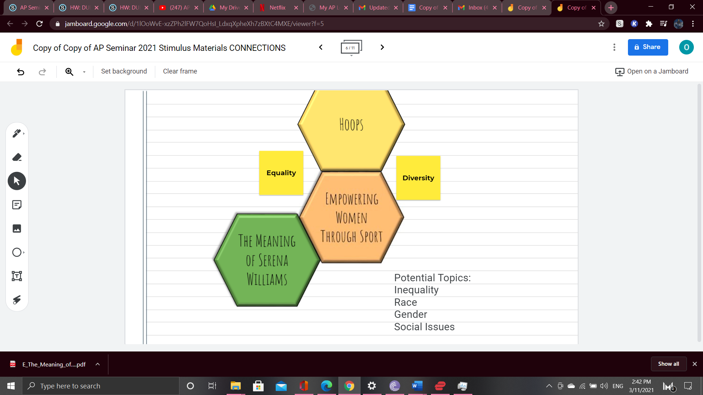

# OSS Contribution Demo

Hello, and welcome to this simple demo on how to contribute!

## Contributing

Before you start working on something, it's best to check if there is an existing issue first. It's also a good idea to stop by the Discord server and confirm with the team if it makes sense or if someone else is already working on it.

Please make sure to read the Contributing Guide before making a pull request.

Thank you to everyone contributing!